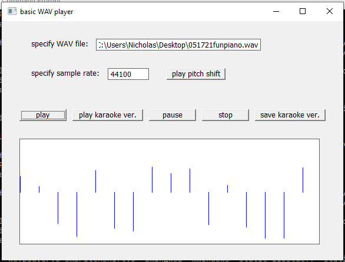

A WAV player that has basic functionality such as play, stop, and pause as well as rudimentary vocal removal, pitch shifting and high/lowpass filtering.      
    
    
    
## acknowledgements:    
Many thanks to Olli Parviainen's awesome SoundTouch library (https://codeberg.org/soundtouch/soundtouch/src/branch/master/source), which I used for the pitch shifting feature.    
    
Also thanks to Stephan Bernsee's code (http://blogs.zynaptiq.com/bernsee/pitch-shifting-using-the-ft/), which I used initially for pitch shifting.    
    
And thanks to Vegard Fiksdal's code (https://github.com/vfiksdal/rtfir) for filters (i.e. lowpass, highpass, etc.).