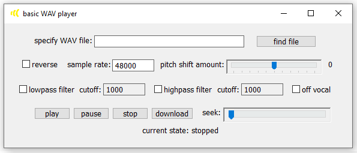

A WAV player that will have basic functionality such as play, stop, and pause as well as rudimentary vocal removal.    
I'm hoping to eventually read up on more advanced audio processing techniques like pitch and time scaling and implement those too.    
    
Currently this application can only play and stop.    
    
    